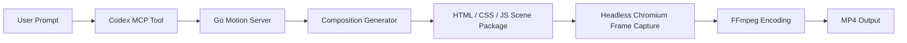

# Go Motion

> A Go-powered Codex plugin for prompt-to-video rendering with HTML, CSS, vanilla JS, bundled Chromium, and FFmpeg.

Go Motion is an open-source Codex plugin that turns prompts into rendered MP4 videos without requiring Node.js on the end user's machine. The plugin ships a Go MCP server, renders browser-native compositions in headless Chromium, and encodes the final output with FFmpeg.

We’re actively open to contributions from Go developers, browser tooling folks, and anyone interested in building a strong Node-free video workflow.

## Why this exists

Remotion-quality workflows are powerful, but they normally depend on a Node.js toolchain. Go Motion explores a different path:

- Go for the plugin server and orchestration
- HTML, CSS, and vanilla JS for compositions
- bundled runtimes so users do not need Node or Go installed
- a prompt-to-video workflow designed for Codex

## What you get

- Prompt-driven video generation through an MCP tool interface
- Browser-native rendering for strong layout and animation fidelity
- Packaged Windows runtime with Chromium and FFmpeg included
- Composition generation using plain HTML, CSS, and vanilla JS
- Open-source repository ready for contributors

## How it works

## Current status

The Windows build in this repository is already working end to end.

- MCP server is compiled and bundled
- Chromium runtime is bundled
- FFmpeg runtime is bundled
- `generate_video` renders real MP4 output locally

Current scope:

- Windows `amd64`
- local rendering
- prompt-to-video flow

## Repository map

- [`plugins/go-motion`](./plugins/go-motion): main Codex plugin bundle
- [`plugins/go-motion/.codex-plugin/plugin.json`](./plugins/go-motion/.codex-plugin/plugin.json): plugin manifest
- [`plugins/go-motion/.mcp.json`](./plugins/go-motion/.mcp.json): MCP server launcher
- [`plugins/go-motion/README.md`](./plugins/go-motion/README.md): plugin-focused technical notes
- [`docs/USAGE.md`](./docs/USAGE.md): usage and runtime layout
- [`docs/superpowers/specs`](./docs/superpowers/specs): design documentation
- [`docs/superpowers/plans`](./docs/superpowers/plans): implementation plan

## Quick start

1. Clone this repository.
2. Open the plugin at [`plugins/go-motion`](./plugins/go-motion).
3. Ensure the bundled Windows runtime remains under `plugins/go-motion/runtime/windows-amd64/`.
4. Configure Codex to load the plugin through the provided manifest and MCP launcher.
5. Call the `generate_video` tool from Codex with a prompt.

More detail is in [`docs/USAGE.md`](./docs/USAGE.md).

## Project philosophy

Go Motion is not trying to copy React internally. It aims to deliver professional-looking video output with a browser-native composition runtime instead:

- layout and styling come from real web rendering
- timing and animation are driven by vanilla JS
- video assembly is handled by FFmpeg

That makes the system easier to ship as a self-contained plugin while still staying close to modern browser rendering quality.

## Contributing

Contributions are welcome. If you want to improve rendering quality, composition ergonomics, packaging, or cross-platform support, start here:

- [`CONTRIBUTING.md`](./CONTRIBUTING.md)
- [`plugins/go-motion/README.md`](./plugins/go-motion/README.md)

## License

Released under the [`MIT License`](./LICENSE).
